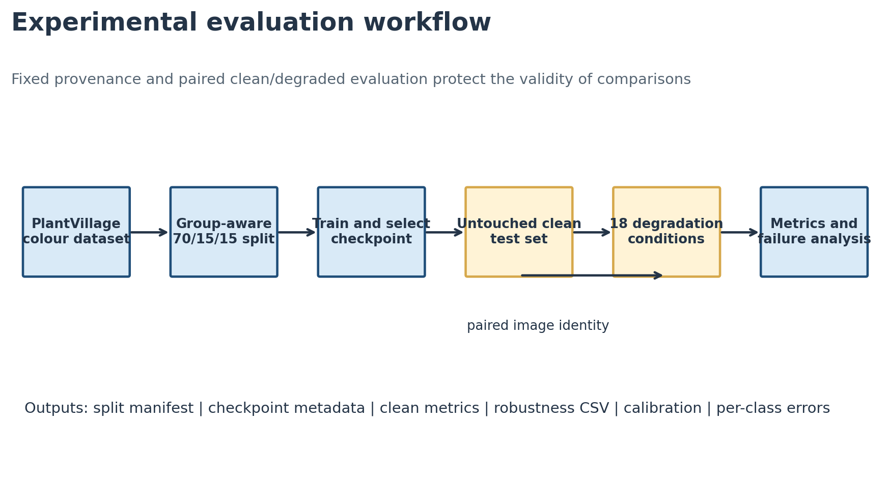
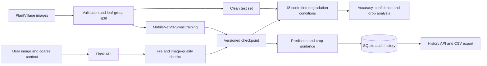

# PlantGuard Lab

[](https://github.com/sshyam67/plantguard-lab/actions/workflows/tests.yml)


**A reproducible plant-disease classification system that tests whether a high-performing model stays reliable when real-world image quality deteriorates.**

PlantGuard Lab combines a MobileNetV3-Small transfer-learning pipeline, 18 controlled robustness conditions, image-quality screening, contextual metadata, and an auditable Flask application. The focus is not another headline accuracy score—it is reliable, traceable behaviour under blur, poor lighting, noise, compression, and low resolution.

> Research use only. PlantGuard is not a substitute for an agronomist, plant pathologist, or laboratory diagnosis.

## Results at a glance

| Measure | Result |
|---|---:|
| Clean test accuracy | **99.37%** |
| Validation accuracy, best epoch | **99.30%** |
| Test images per condition | **8,114** |
| Robustness conditions | **18 + clean baseline** |
| Largest observed accuracy drop | **50.42 pp** under severe blur |

The result is deliberately cautionary: controlled-image accuracy remained high, but severe blur reduced accuracy to 48.95%, severe noise to 60.11%, and severe darkness to 62.03%. The experiment shows why input validation and robustness evaluation belong in the system—not just in a model notebook.



## What makes this project different

- **Leakage-aware data preparation** — related leaf images stay within the same split where source mappings allow it.
- **Paired robustness evaluation** — the same test set is evaluated clean and under six degradation families at three severity levels.
- **Safe demo mode** — without a trained checkpoint, the app never fabricates a diagnosis.
- **Traceable predictions** — timestamp, model version, confidence, quality score, and coarse context are recorded in SQLite.
- **Quality-aware UX** — low resolution, blur, brightness, and other quality issues are surfaced alongside results.
- **Responsible framing** — no precise location or personal data is collected, and every output carries a research disclaimer.

## System architecture



Training and evaluation remain offline so serving traffic cannot alter experimental results.

## Robustness findings

| Condition | Mild | Moderate | Severe |
|---|---:|---:|---:|
| Blur | 97.52% | 77.29% | 48.95% |
| Darkness | 99.08% | 97.19% | 62.03% |
| Brightness | 99.22% | 96.97% | 85.36% |
| Gaussian noise | 98.64% | 82.83% | 60.11% |
| Resolution loss | 98.60% | 94.34% | 72.69% |
| JPEG compression | 99.06% | 98.41% | 79.78% |

Full reproducible results are in [`artifacts/robustness_results.csv`](artifacts/robustness_results.csv).

## Project structure

```text
app.py                      Flask application and audit API
src/model.py                MobileNetV3 model and checkpoint loading
src/train.py                Reproducible transfer-learning pipeline
src/evaluate_robustness.py  Clean and degraded evaluation
src/degradations.py         Six controlled image degradations
src/quality.py              Input quality scoring and warnings
src/guidance.py             Responsible crop-care guidance
scripts/                    Dataset download and preparation
tests/                      API, quality, and degradation tests
data/                       Dataset card and schema dictionaries
artifacts/                  Small result tables and architecture figures
docs/                       Implementation and evaluation guide
```

## Run locally

Python 3.10 or 3.11 is recommended.

```powershell
git clone https://github.com/sshyam67/plantguard-lab.git
cd plantguard-lab
py -3.10 -m venv .venv
.\.venv\Scripts\Activate.ps1
python -m pip install --upgrade pip
pip install -r requirements.txt
pytest -q
python app.py
```

Open `http://127.0.0.1:5000`. Without `artifacts/best_model.pt`, the interface runs in explicit demo mode and demonstrates validation, image-quality checks, metadata capture, and audit logging without claiming a disease prediction.

## Reproduce the experiment

```powershell
python scripts/download_dataset.py
python scripts/prepare_dataset.py
python -m src.train --data-dir data/processed --epochs 12 --seed 42
python -m src.evaluate_robustness --data-dir data/processed --model artifacts/best_model.pt
```

The dataset and trained checkpoint are intentionally excluded from Git because of size. The downloader uses the maintained PlantVillage source, and the training/evaluation outputs are written to `artifacts/`.

## API

| Endpoint | Method | Purpose |
|---|---|---|
| `/` | GET | Research interface |
| `/api/predict` | POST | Validate an image, assess quality, predict, and audit |
| `/api/history` | GET | Return the latest 100 audit records |
| `/api/export.csv` | GET | Export prediction history |
| `/api/health` | GET | Report service and model readiness |

Uploads accept JPEG or PNG files up to 8 MB. Operator notes are limited to 500 characters.

## Data and ethics

PlantVillage reports 54,306 images across 14 crop species, 26 diseases, and 38 crop-condition classes. Its controlled backgrounds make it useful for benchmarking but do not establish field reliability. See the [dataset card](data/DATASET_CARD.md) for provenance, split policy, limitations, and citation.

The application stores no uploaded image and requests only coarse optional context. Before any real deployment, the system would require field validation, security hardening, calibrated uncertainty, monitoring, and review by qualified agricultural specialists.

## Testing

```powershell
pytest -q
```

The suite covers API health and safe demo behaviour, bounded image-quality scoring, low-resolution warnings, every degradation type, and invalid severity handling. GitHub Actions runs the same checks on every push and pull request.

## Roadmap

- Add per-class precision, recall, F1, and confusion-matrix reporting to the public artifacts.
- Measure calibration error and confidence under distribution shift.
- Add bootstrap confidence intervals and paired statistical tests.
- Evaluate on independent field-image datasets.
- Package inference in a container and add production monitoring.

## License

Released under the [MIT License](LICENSE). Dataset images retain their original source licence and are not redistributed in this repository.
